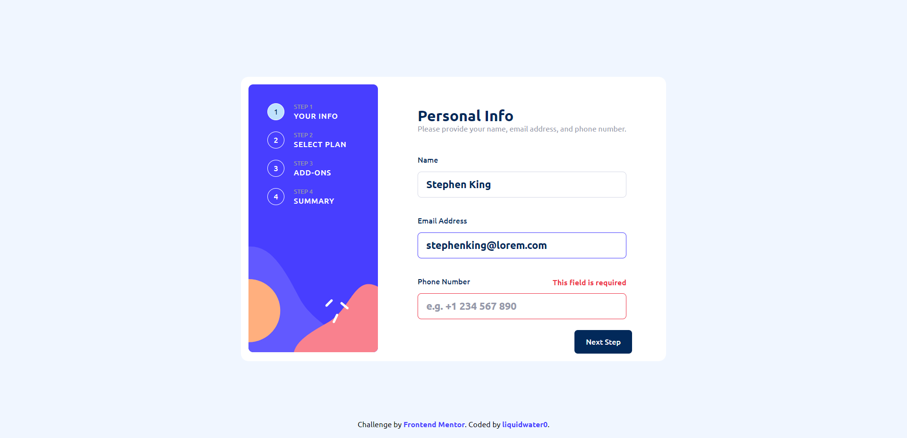

# Frontend Mentor - Multi-step form solution

This is a solution to the [Multi-step form challenge on Frontend Mentor](https://www.frontendmentor.io/challenges/multistep-form-YVAnSdqQBJ). Frontend Mentor challenges help you improve your coding skills by building realistic projects. 

## Table of contents

- [Overview](#overview)
  - [The challenge](#the-challenge)
  - [Screenshot](#screenshot)
  - [Links](#links)
- [My process](#my-process)
  - [Built with](#built-with)
  - [Continued development](#continued-development)
  - [Useful resources](#useful-resources)
- [Author](#author)

## Overview

### The challenge

Users should be able to:

- Complete each step of the sequence
- Go back to a previous step to update their selections
- See a summary of their selections on the final step and confirm their order
- View the optimal layout for the interface depending on their device's screen size
- See hover and focus states for all interactive elements on the page
- Receive form validation messages if:
  - A field has been missed
  - The email address is not formatted correctly
  - A step is submitted, but no selection has been made

### Screenshot

### Links

- Solution URL: [https://www.frontendmentor.io/solutions/multistep-form-built-in-html-scss-reactjs-and-typescript-hwrtza86Ga](https://www.frontendmentor.io/solutions/multistep-form-built-in-html-scss-reactjs-and-typescript-hwrtza86Ga)
- Live Site URL: [https://liquidwater0.github.io/multi-step-form/](https://liquidwater0.github.io/multi-step-form/)

## My process

### Built with

- Semantic HTML5 markup
- CSS custom properties
- Flexbox
- CSS Grid
- [React](https://reactjs.org/) - JS library
- [Sass](https://sass-lang.com/) - CSS preprocessor

### Continued development

I would like to maybe improve on my accessibility and CSS skills.

### Useful resources

- [Regexr](https://regexr.com/) - I wasn't able to get some of the patterns for the inputs the way I wanted, but I got something that was good enough, and I was able to achieve that with this website.

## Author

- Frontend Mentor - [@liquidwater0](https://www.frontendmentor.io/profile/liquidwater0)